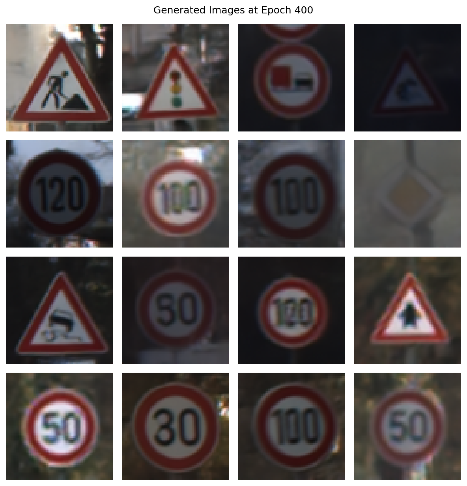
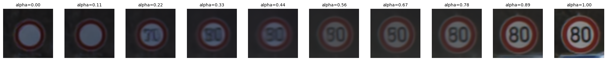
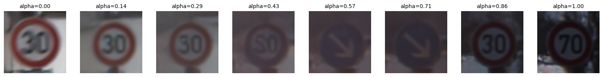
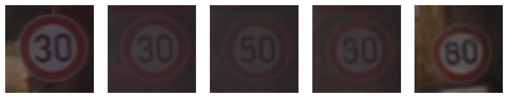
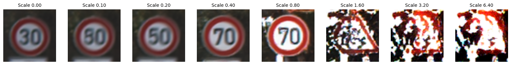

# Road Sign Generation using Diffusion Models

A generative AI project that uses diffusion models to synthesize realistic road sign images from the GTSRB (German Traffic Sign Recognition Benchmark) dataset.

## Overview

This project implements a diffusion-based generative model to create synthetic traffic sign images. The model is trained on the GTSRB dataset and can generate new road sign variations, interpolate between different noise vectors, and explore the latent space through noise perturbation.


## Dataset

**GTSRB (German Traffic Sign Recognition Benchmark)**
- Contains 43 classes of road signs
- ~50,000 training images
- The project uses a filtered subset of 22,000 images with minimum dimension >= 32 pixels
- Images are resized to 64×64 pixels

The dataset is automatically downloaded via torchvision's GTSRB dataset loader.

## Model Architecture

### UNet with Skip Connections
The architecture consists of:
- **Input:** 64×64 RGB images + noise variance embedding
- **Encoder:** 3 downsampling blocks with residual connections
- **Bottleneck:** 2 residual blocks at the deepest level
- **Decoder:** 3 upsampling blocks with skip connections from encoder
- **Output:** Predicted noise for the denoising process

## Key Parameters

| Parameter | Value | Description |
|-----------|-------|-------------|
| Image Size | 64×64 | Dimensions of training/generated images |
| Batch Size | 128 | Training batch size |
| Epochs | 400 | Total training epochs |
| Learning Rate | 1e-4 | AdamW optimizer learning rate |
| Weight Decay | 1e-4 | L2 regularization |
| EMA | 0.999 | Exponential moving average for target network |
| Noise Embedding Size | 128 | Dimension of noise embeddings |
| Diffusion Steps | 100 | Steps for reverse diffusion during generation |

### Notebook Sections

1. **Load Dataset** - Downloads and preprocesses GTSRB images
2. **Define Model** - Builds the UNet architecture and diffusion model
3. **Training** - Trains the model for 400 epochs with checkpointing
4. **Visualize Loss** - Plots training loss curve
5. **Epoch Grids** - Displays generated images from different training epochs
6. **Generated Images** - Shows a grid of final generated images (epoch 400)
7. **Noise Interpolation** - Linearly interpolates between two random noise vectors
8. **Noise Perturbation** - Explores how perturbation scale affects generation

## Setup & Installation

### How to run

1. Create a virtual environment:
```bash
conda create -n roadsigns python=3.11
conda activate roadsigns
```

2. Install dependencies:
```bash
pip install -r requirements.txt
```


## Training
```bash
main.ipynb
```

Run all cells.

## Generating images with loaded weights

```bash
main.ipynb
```

Run cells:
- Imports
- Constants
- Define model

Then any of the following:
- Display images from different epochs
- Display generated images to see grid of images
- Noise interpolation
- Noise perturbation

## Difficulties
For the first few attempts at training, the generated images were extremely deformed. I was using 10000 images, an image size of 128, a batch size of 256, a noise embedding size of 32, and training for 400 epochs. I thought that training for longer would improve the quality, so I repeated training with 800 epochs, but the results were still very poor. I made several changes for the following reasons:
-	Increasing the width of the unet — learns more details 
-	Increasing the dataset size to 22000
-	Decreasing the image size to 64 — I think 128 was too large because most of the images in the dataset were not above 64 pixels
-	Decreasing the batch size — more gradient updates for each epoch
-	Increasing the noise embedding size to 128 — finer details

Once I made those changes the model was generating readable signs.

I noticed one sign that was not in the original dataset, which was a blank speed limit sign. I did not recognize any other images that were novel. I thought that if I trained long enough it would start to generate new signs, but the loss didn’t appear to be decreasing any further.

I attempted to do DDIM inversion to get the noise that a real image would have started from, but the loss between the original and reconstructed image was really high so I pursed other types of latent space exploration.


## Results

### Generated Images at Epoch 400

The model successfully generates realistic synthetic road signs after 400 epochs of training:



### Extra Criteria
By interpolating between noise vectors, I was able to generate some images that were clear(ish) and not in the original dataset. To do this, I took two random noise vectors and interpolated between them. Some of the interesting results:


 
Between blank speed limit (not in dataset) and 80 speed limit, there’s one that kind of looks like 𝛑 speed limit.



Backwards 2 somewhere between 30 speed limit and 70 speed limit.



Interesting blend from 30 to 80 that hits 50 in the middle.



I also looked into noise perturbation adding the same noise scaled by different values to some base noise vector. In some of the cases this actually made the base image appear clearer and brighter. Too much scaling of the perturbation made the noise exit the normal distribution and that showed gibberish, but you could kind of still see a shape.